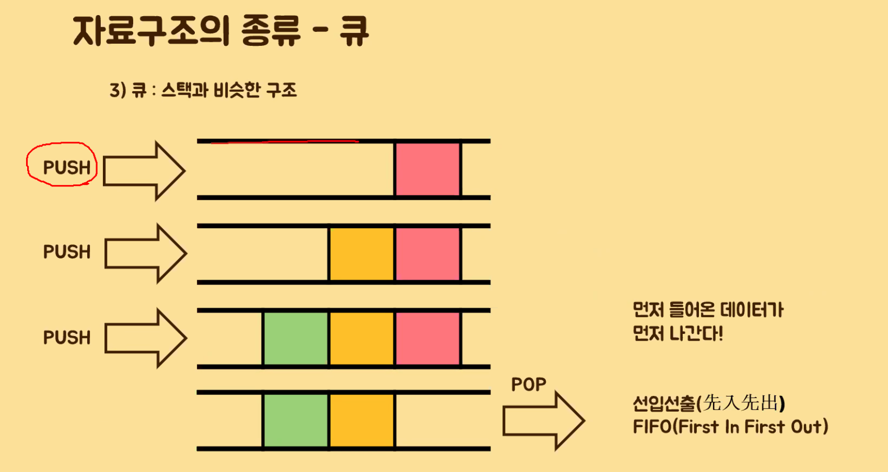
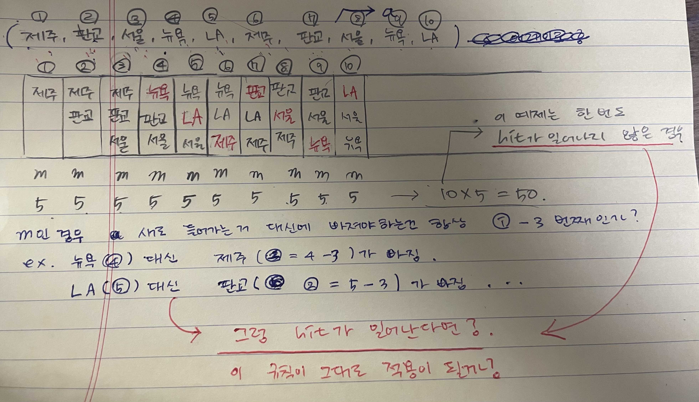
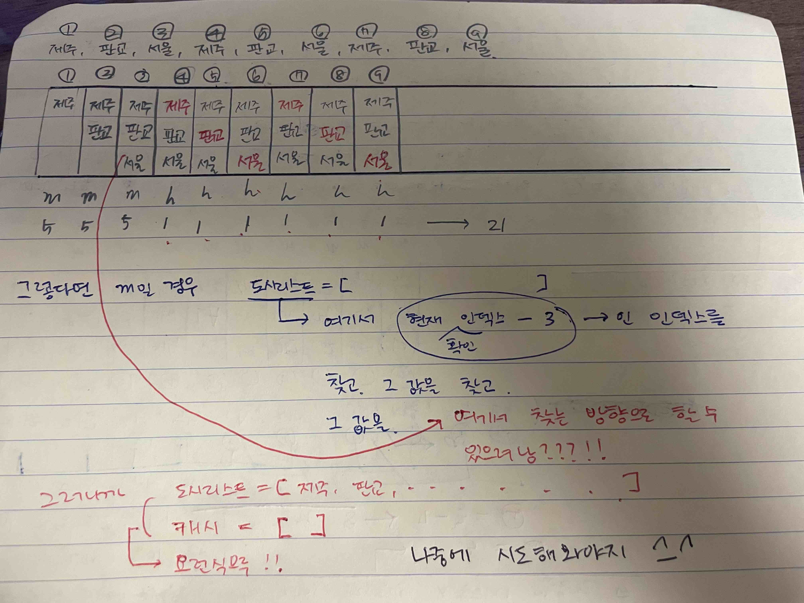

# 1. 자료구조와 알고리즘, 코딩테스트

-   추천 서적
    -   학문적 접근 : The Art of Computer Programming(도널드 커누스)
    -   코딩테스트 접근 : 파이썬 알고리즘 인터뷰(박상길)
    -   기타 : 파이썬 자료구조와 알고리즘(중학교 학생 가르칠 때 사용), 그림으로 배우는 알고리즘(코드 없고 그림만 있습니다), 알고리즘 산책(역사적인 알고리즘을 쭉 훑어봅니다. 수학적인 내용이 많고 코드는 C++로 되어 있으나 보는데 큰 무리는 없습니다.)

## 1.1 코테 전 준비사항

1. 플렛폼에 익숙해지자! (프로그래머스, 구름EDU 등)
    - 프로그래머스 Node Version(12) -> replaceAll(15)
    - 사용 가능 라이브러리 미리 확인 등
    - 대부분 numpy나 pandas 같은 라이브러리 사용 금지이지만 간혹가다 제한이 없는 곳도 있습니다. numpy는 python보다 대부분의 경우 속도가 빠릅니다. 크기에 따라 다르지만 100000개 이상의 배열의 연산의 경우 50배 이상의 성능을 보입니다.
2. 언어 선택(속도 : C++, 풀이 : Python)
3. 코드 스니펫(트리, 검색, 최단경로(예를 들어 다익스트라), 직접 제작한 함수 등), Cheatsheet, A4 용지 준비
4. 유용한 라이브러리 정리! (collections, itertools(순열, 조합), functools, itertools, re, bisect 등) - [제주코딩베이스캠프](https://www.youtube.com/channel/UC4GnvNKtuJ4cqWsYjxNxAEQ) 유튜브 채널 확인
5. 기억해두자! 예외처리!
6. 속도개선
    1. class로 구현
    2. 메서드 대신 슬라이싱 구현(슬라이싱은 C로 구현되어 있어 메서드보다 통상 8배정도 빠릅니다.)하세요. 다만 공간복잡도가 상승할 수 있습니다. (리스트.reverse(), reversed(리스트), 리스트[::-1])
    3. for문 대신 list comprehension을 사용하세요. 더 빠릅니다.
    4. 재귀는 느립니다. 최후의 수단으로 사용하세요.

## 1.2 문제 유형과 출제 방식

-   5 ~ 6시간, 6 ~ 7문제
-   30분씩 4문제, 2시간씩 2문제
-   문제 유형 분석 관련 글
    -   [문제 유형 분석](https://www.hanbit.co.kr/media/channel/view.html?cms_code=CMS4385594264)
    -   [언어 유불리 여부](https://www.hanbit.co.kr/media/channel/view.html?cms_code=CMS9145550324&cate_cd=)
    -   [코딩 테스트에 가장 많이 출제 되는 알고리즘](https://www.hanbit.co.kr/media/channel/view.html?cms_code=CMS7793635735&cate_cd=)
        -   요구사항 구현 알고리즘(33%)
        -   그리디 알고리즘(20%)
        -   너비우선탐색, 깊이우선탐색(20%)
        -   정렬(8%)
        -   다이나믹 프로그래밍, 최단경로, 이진 탐색 등
-   전체 문제 유형
    -   알고리즘
        -   정렬
        -   이진 검색
        -   비트 연산
        -   슬라이딩 윈도우, 페이지 교체, 투포인트
        -   분할 정복
            -   그리디 알고리즘
            -   다이나믹 프로그래밍
            -   퀵소트, 병합정렬
    -   자료구조
        -   선형
            -   스택과 큐, 데크
            -   연결리스트, 해시 테이블
        -   비선형
            -   그래프(최단경로) - 다익스트라가 나오면 매우 어려운 문제
            -   트리
                -   힙
                -   트라이

## 1.3 워밍업 문제

-   활용할 수 있는 기본 개념 코드

```js
Number.MAX_SAFE_INTEGER;
Number.MIN_SAFE_INTEGER;

Infinity - Infinity; // NaN
(123.45).toFixed(); // 123
(123.45).toFixed(1); // 123.4

const arr = [1, 2, 3, 4, 5];
const result = arr.reduce((a, c) => (a += c));

// 평평하게 만들기 - flat()
[1, [2, [3, [4]]]].flat(); // -> [1, 2, [3, [4]]]
[1, [2, [3, [4]]]].flat(1); // -> [1, 2, [3, [4]]]
[1, [2, [3, [4]]]].flat(2); // -> [1, 2, 3, [4]]
[1, [2, [3, [4]]]].flat(Infinity);

// 배열 만들기
Array(10).fill(0);
[...Array(10)].map((_, i) => i + 1);
".".repeat(10).split("."); // 권장하지 않습니다.
".".repeat(9).split(".");
// Array.from(): 유사 배열 객체를 배열로 만들 때
Array.from("ab".repeat(10));
// 20) ['a', 'b', 'a', 'b', 'a', 'b', 'a', 'b', 'a', 'b', 'a', 'b', 'a', 'b', 'a', 'b', 'a', 'b', 'a', 'b']
```

-   활용할 수 있는 커스텀 메서드

```js
const zip = (a, b) => a.map((v, i) => [v, b[i]]);
// zip('hello', [10, 20, 30, 40, 50]) // error
zip([10, 20, 30, 40, 50], "hello"); // 성공
// (5) [Array(2), Array(2), Array(2), Array(2), Array(2)]
// (2) [10, 'h']
// (2) [20, 'e']
// (2) [30, 'l']
// (2) [40, 'l']
// (2) [50, 'o']
zip([10, 20, 30], [1, 2, 3]);
// (3) [Array(2), Array(2), Array(2)]
// (2) [10, 1]
// (2) [20, 2]
// (2) [30, 3]
zip([10, 20, 30], [1, 2, 3, 4]);
// (3) [Array(2), Array(2), Array(2)]
// (2) [10, 1]
// (2) [20, 2]
// (2) [30, 3]
zip([10, 20, 30, 4], [1, 2, 3]);
// (4) [Array(2), Array(2), Array(2), Array(2)]
// (2) [10, 1]
// (2) [20, 2]
// (2) [30, 3]
// (2) [4, undefined]
```

### 1.3.1 워밍업 문제(google)

1부터 10,000까지 8이라는 숫자가 총 몇번 나오는가?

8이 포함되어 있는 숫자의 갯수를 카운팅 하는 것이 아니라 8이라는 숫자를 모두 카운팅 해야 한다.
(※ 예를들어 8808은 3, 8888은 4로 카운팅 해야 함)

문제 링크 : https://codingdojang.com/scode/393

-   풀이
    ```js
    // 내 풀이 (1): 정규 표현식 + match 메서드 사용했으면 더 좋았을듯!
    let str = '';

    for (let i = 1; i <= 10000; i++){
        str += i;
    }

    let count = 0;
    for (let i = 0; i < str.length; i++){
        if (str[i] == 8){
                count++;
        }
    }
    console.log(count);    
    ```
    아래 코드는 [이 사이트](https://deeplify.dev/front-end/js/count-characters-in-string) 참고함!
    ```js
    // 내 풀이 (2)
    let count = 0;

    for (let i = 1; i <= 10000; i++){
        let pos = i.toString().indexOf('8');
        while (pos !== -1){
            count++;
            pos = i.toString().indexOf('8', pos + 1);
        }
    }

    console.log(count);
    ```
    ```js
    // '123433332121'.match(/1/g)
    // (3) ['1', '1', '1']
    // 'hello world hello'.match(/hello/g)
    // (2) ['hello', 'hello']

    let str = "";

    for (let i = 1; i <= 10000; i++) {
        str += i;
    }

    console.log(str.match(/8/g).length);
    ```
    ```js
    let str = "";
    for (let i = 1; i <= 10000; i++) {
        str += i;
    }
    console.log(str.split("").filter((item) => item === "8").length);
    ```
    ```js
    // [...Array(3)] 
    // (3) [undefined, undefined, undefined]
    const arr = [...Array(10000)].map((_, i) => i + 1).toString().match(/8/g).length;
    console.log(arr);
    ```
    ```js
    new Array(10000).fill(0).map((_, i) => i + 1).join('').match(/8/g).length;
    ```
    ```js
    let arr = []
    for(let i = 1;i<=10000;i++){
        arr.push(i);
    }
    let result = [...arr.join('')].filter(el=>el==='8').length
    console.log(result)
    ```

### 1.3.2 워밍업 문제(daum)

1차원의 점들이 주어졌을 때, 그 중 가장 거리가 짧은 것의 쌍을 출력하는 함수를 작성하시오. (단 점들의 배열은 모두 정렬되어있다고 가정한다.)

예를들어 S = [1, 3, 4, 8, 13, 17, 20] 이 주어졌다면, 결과값은 (3, 4)가 될 것이다.

문제링크 : https://codingdojang.com/scode/408

-   풀이
    ```js
    // 내 풀이
    const arr = [1, 3, 4, 8, 13, 17, 20];
    const res = [];
    arr.reduce((acc, cur, i) => {
        if (i === 0){
            return acc + Infinity;
        } else {
            // Math.abs 처음에 안 했는데, '거리'중 제일 짧은 거를 구해야하는 거니까 절대값 취해야 함!
            const diff = Math.abs(cur - arr[i - 1]);
            if (diff < acc){
                res[0] = arr[i - 1];
                res[1] = arr[i];
                return acc = diff;
            } else {
                return acc;
            }
        }
    }, 0)
    console.log(res);
    ```
    앞 요소나 뒤 요소를 알아야 하기 때문에 for of문은 적절하지 않다.
    ```js
    // 기본적인 풀이
    let dots = [1, 3, 4, 8, 13, 17, 20];
    let 최솟값 = Infinity;
    let 최솟값인덱스 = 0;

    for (let i = 1; i < dots.length; i++) {
        if (Math.abs(dots[i] - dots[i - 1]) < 최솟값) {
            최솟값 = Math.abs(dots[i] - dots[i - 1]);
            최솟값인덱스 = i;
        }
    }
    console.log(dots[최솟값인덱스], dots[최솟값인덱스 - 1]);
    ```

    -   아래와 같은 방식으로 풀이 예정

    ```python
    list(zip('hello world', [10, 20, 30, 40, 50]))
    list(zip([1, 3, 4, 8, 13, 17, 20], [3, 4, 8, 13, 17, 20]))
    sorted(zip([1, 3, 4, 8, 13, 17, 20], [3, 4, 8, 13, 17, 20]), key=lambda i:i[1]-i[0])
    sorted(zip([1, 3, 4, 8, 13, 17, 20], [3, 4, 8, 13, 17, 20]), key=lambda i:i[1]-i[0])[0]
    ```
    [sort 콜백함수](https://developer.mozilla.org/en-US/docs/Web/JavaScript/Reference/Global_Objects/Array/sort)
    ```js
    const zip = (a, b) => a.map((v, i) => [v, b[i]]);
    let s = [1, 3, 4, 8, 13, 17, 20];

    let pairs = zip(s.slice(0, s.length - 1), s.slice(1));
    // (6) [Array(2), Array(2), Array(2), Array(2), Array(2), Array(2)]
    // (2) [1, 3]
    // (2) [3, 4]
    // (2) [4, 8]
    // (2) [8, 13]
    // (2) [13, 17]
    // (2) [17, 20]

    // sort의 콜백 함수
    // 차이가 작은것부터 큰 거 순서대로(오름차순)
    function 비교(a, b) {
        if (Math.abs(a[1] - a[0]) < Math.abs(b[1] - b[0])) {
            return -1;
        }
        if (Math.abs(a[1] - a[0]) > Math.abs(b[1] - b[0])) {
            return 1;
        }
        return 0;
    }

    pairs.sort(비교);
    pairs.sort(비교)[0];
    ```

    ```js
    const zip = (a, b) => a.map((v, i) => [v, b[i]]);
    let s = [1, 3, 4, 8, 13, 17, 20];

    let pairs = zip(s.slice(0, s.length - 1), s.slice(1));
    let 최솟값 = Infinity;
    let 최솟값쌍 = [];

    for ([i, j] of pairs) {
        if (Math.abs(j - i) < 최솟값) {
            최솟값 = Math.abs(j - i);
            최솟값쌍 = [i, j];
        }
    }
    ```

## 1.4 기본 자료구조 및 알고리즘
[시각화 자료](https://visualgo.net/en)
1. 스택과 큐


2. 연결리스트
3. 트리와 그래프
    - 3.1 트리 구현
    - 3.2 트리의 순회
4. 정렬 알고리즘
    - 4.1 선택정렬
    - 4.2 삽입정렬
    - 4.3 병합정렬
    - 4.4 퀵정렬
5. 페이지 교체 알고리즘
6. 슬라이딩 윈도우와 투 포인터 알고리즘

### 1.4.1 스택과 큐

* 스택 : (삽입)arr.push, (삭제)arr.pop
* 큐: (삽입)arr.push, (삭제)arr.shift
* arr.unshift(1000) : 맨 앞에 1000을 삽입합니다.
* arr.shift() : 맨 앞에 값을 꺼냅니다.
* arr.push : 맨 뒤에 값을 삽입합니다.
* arr.pop : 맨 뒤에 값을 꺼냅니다.


    ```javascript
    // https://ko.wikipedia.org/wiki/%EC%8A%A4%ED%83%9D
    class Stack {
        constructor(){
            this.arr = []; // 연결리스트로 구현할 수도 있지만, 지금 배우지 않았기에 배열로 구현합니다.
            this.length = 0; // 스택이 비었을 때 연산 정의불가 상태를 처리하기 위해
        }

        // S.push(): 스택의 가장 윗 데이터로 top이 가리키는 자리 위에(top = top + 1) 메모리를 생성, 데이터 x를 넣는다.
        push(data){
            this.arr.push(data);
            this.length += 1;
        }

        // S.pop(): 스택의 가장 윗 데이터를 삭제한다. 스택이 비었다면 연산 정의불가 상태.
        pop(index){
            if (this.length == 0){
                return
            }
            if (index > this.arr.length - 1){
                this.length -= 1
                return this.arr.pop()
            }
            let result = this.arr.splice(index, 1)
            this.length -= 1
            return result
        }

        // S.empty(): 스택이 비었다면 1을 반환하고,그렇지 않다면 0을 반환한다.
        empty(){
            if (this.length == 0){
                return 1
            } else {
                return 0
            }
        }

        // S.top(): 스택의 가장 윗 데이터를 반환한다. 만약 스택이 비었다면 이 연산은 정의불가 상태이다.
        top(){
            return this.arr[this.length - 1]
        }

        bottom(){
            return this.arr[0]
        }

        display(){
            return this.arr
        }
    }

    let s = new Stack()
    s.push(10)
    s.push(20)
    s.push(30)
    s.push(40)
    s.push(50)
    s.display() // (5) [10, 20, 30, 40, 50]
    s.pop(10) // 50
    s.display() // (4) [10, 20, 30, 40]
    s.pop(1) // 20
    s.display() // (3) [10, 30, 40]
    s.empty() // 0
    s.bottom() // 10
    s.top() // 40
    ```

### 1.4.2 연결리스트

-   연결리스트, 메모리 효율을 위해 사용되는 경우가 많음
-   js에서는 그다지 메모리 효율이 좋지 못함
-   개념 : https://en.wikipedia.org/wiki/Linked_list
-   강의: https://www.youtube.com/watch?v=DzGnME1jIwY
    -   길이가 정해지지 않은 데이터를 핸들링할 때       
-   알고리즘 시각화 : https://visualgo.net/ko

1. step 1 - object로 linkedlist 구현

    ```javascript
    // 여러분이 다 이해하실 수 있는 코드로 설명해보겠습니다.
    const list = {
        head: {
            value: 46,
            next: {
                value: 49,
                next: {
                    value: 97,
                    next: {
                        value: 12,
                        next: null,
                    },
                },
            },
        },
    };
    // list.head.next.next.value
    // list.head.next.next.next.value

    let list = {
        head: null,
    };

    let node1 = { value: 46, next: null };
    let node2 = { value: 49, next: null };
    let node3 = { value: 97, next: null };
    let node4 = { value: 12, next: null };

    node1.next = node2;
    node2.next = node3;
    node3.next = node4;

    list.head = node1;


    ```

-   문제

    ```js
    // head -> [90, next] -> [2, next] -> [77, next] -> [35, next] -> [21, next] -> null
    // 35를 출력해주세요.
    const list = {
        head: {
            value: 90,
            next: {
                value: 2,
                next: {
                    value: 77,
                    next: {
                        value: 35,
                        next: {
                            value: 21,
                            next: null,
                        },
                    },
                },
            },
        },
    };
    list.head.next.next.next.value;
    ```

2. step 2 - class로 node 구현

    ```javascript
    // 위 문제 처럼 만들어 보도록 하겠습니다.
    // head -> [90, next] -> [2, next] -> [77, next] -> [35, next] -> [21, next] -> null
    // 35를 출력해주세요.
    class Node {
        constructor(data) {
            this.data = data;
            this.next = null;
        }
    }

    node1 = new Node(90);
    node2 = new Node(2);
    node3 = new Node(77);
    node4 = new Node(35);
    node5 = new Node(21);

    node1.next = node2;
    node2.next = node3;
    node3.next = node4;
    node4.next = node5;

    node1.data;
    // 90
    node1.next.next.data;
    // 77
    node1.next.next.next.data;
    // 35
    ```

3. step 3 - class로 linkedList 구현
[호준님 강의](https://www.youtube.com/watch?v=dvKuG3gfLFQ)
    ```js
    // head -> ['init', next]
    //               ↑
    //              tail

    // head -> ['init', next] -> [90, next]
    //                               ↑
    //                              tail
    class Node {
        constructor(data) {
            this.data = data;
            this.next = null;
        }
    }

    class LinkedList {
        constructor() {
            let init = new Node("init");
            this.head = init;
            this.tail = init;
        }

        append(data) {
            let 새로운노드 = new Node(data);
            // 마지막 값(null)은 새로운 노드가 됨
            this.tail.next = 새로운노드;
            // 마지막 노드는 새로운 노드가 됨
            this.tail = 새로운노드;
        }
    }

    l = new LinkedList();
    l.append(1);
    l.append(2);
    l.append(3);
    l.append(10);
    l.append(20);
    l.append(30);

    // l.head.data
    // 'init'
    // l.head.next.data
    // 1
    // l.head.next.next.data
    // 2
    // l.head.next.next.next.data
    // 3

    // 새로운노드 = node(1, null)
    // init.next 값은 null인데! null자리를 '새로운노드node(1, null)'로!
    // this.tail은 이제 node(1, null)
    //
    // 새로운노드 = node(2, null)
    // node(1, null).next 값은 null인데! null자리를 '새로운노드node(2, null)'로!
    // node(1, null) = 새로운노드node(2, null)
    //
    // 새로운노드 = node(3, null)
    // node(2, null).next값은 null인데! null자리를 '새로운노드node(3, null)'로!
    // node(2, null) = 새로운노드node(3, null)
    ```

4. step 4 - class로 linkedList에서 length 구현

    ```js
    // head -> ['init', next]
    //               ↑
    //              tail

    // head -> ['init', next] -> [90, next]
    //                               ↑
    //                              tail

    // 여기서 데이터를 추가하면 생성되는 노드마다 데이터 공간이 할당되는 것이라 메모리가 크게 필요하게 됩니다.
    class Node {
        constructor(data) {
            this.data = data;
            this.next = null;
        }
    }

    class LinkedList {
        constructor() {
            let init = new Node("init");
            this.head = init;
            this.tail = init;
            this.length = 0;
        }

        length() {
            return this.length;
        }

        append(data) {
            let 새로운노드 = new Node(data);
            // 마지막 값(null)은 새로운 노드가 됨
            this.tail.next = 새로운노드;
            // 마지막 노드는 새로운 노드가 됨
            this.tail = 새로운노드;
            this.length += 1;
        }
    }

    l = new LinkedList();
    l.append(1);
    l.append(2);
    l.append(3);
    l.append(10);
    l.append(20);
    l.append(30);
    ```

5. step 5 - class로 linkedList에서 toString 구현

    ```js
    class Node {
        constructor(data) {
            this.data = data;
            this.next = null;
        }
    }

    class LinkedList {
        constructor() {
            let init = new Node("init");
            this.head = init;
            this.tail = init;
            this.length = 0;
            this.displayData = "";
        }

        length() {
            return this.length;
        }

        toString() {
            return "<" + this.displayData.slice(0, -2) + ">";
        }

        append(data) {
            let 새로운노드 = new Node(data);
            // 마지막 값(null)은 새로운 노드가 됨
            this.tail.next = 새로운노드;
            // 마지막 노드는 새로운 노드가 됨
            this.tail = 새로운노드;
            this.length += 1;
            this.displayData += `${data}, `;
        }
    }

    l = new LinkedList();
    l.append(1);
    l.append(2);
    l.append(3);
    l.append(10);
    l.append(20);
    l.append(30);
    ```

6. step 6 - class로 linkedList에서 toArray 구현

    ```js
    class Node {
        constructor(data) {
            this.data = data;
            this.next = null;
        }
    }

    class LinkedList {
        constructor() {
            let init = new Node("init");
            this.head = init;
            this.tail = init;
            this.length = 0;
            this.displayData = "";
            this.displayDataArr = [];
        }

        length() {
            return this.length;
        }

        toString() {
            return "<" + this.displayData.slice(0, -2) + ">";
        }

        toArray() {
            return this.displayDataArr;
        }

        append(data) {
            let 새로운노드 = new Node(data);
            // 마지막 값(null)은 새로운 노드가 됨
            this.tail.next = 새로운노드;
            // 마지막 노드는 새로운 노드가 됨
            this.tail = 새로운노드;
            this.length += 1;
            this.displayData += `${data}, `;
            this.displayDataArr.push(data);
        }
    }

    l = new LinkedList();
    l.append(1);
    l.append(2);
    l.append(3);
    l.append(10);
    l.append(20);
    l.append(30);
    ```

7. step 7 - (중요) toString을 순회로 구현

    ```js
    class Node {
        constructor(data) {
            this.data = data;
            this.next = null;
        }
    }

    class LinkedList {
        constructor() {
            let init = new Node("init");
            this.head = init;
            this.tail = init;
            this.length = 0;
        }

        length() {
            return this.length;
        }

        toString() {
            let 순회용현재노드 = this.head;

            //처음 순회용 현재 노드가 init이기 때문에
            순회용현재노드 = 순회용현재노드.next;

            let 출력데이터 = "";
            for (let i = 0; i < this.length; i++) {
                출력데이터 += `${순회용현재노드.data}, `;
                순회용현재노드 = 순회용현재노드.next;
            }

            return 출력데이터;
        }

        append(data) {
            let 새로운노드 = new Node(data);
            // 마지막 값(null)은 새로운 노드가 됨
            this.tail.next = 새로운노드;
            // 마지막 노드는 새로운 노드가 됨
            this.tail = 새로운노드;
            this.length += 1;
        }
    }

    l = new LinkedList();
    l.append(1);
    l.append(2);
    l.append(3);
    l.append(10);
    l.append(20);
    l.append(30);
    ```
8.  step 8 - data를 arr로 만들기

    [JSON.parse() 메서드는 JSON 문자열의 구문을 분석하고, 그 결과에서 JavaScript 값이나 객체를 생성합니다.](https://developer.mozilla.org/ko/docs/Web/JavaScript/Reference/Global_Objects/JSON/parse#:~:text=JSON.parse()%20%EB%A9%94%EC%84%9C%EB%93%9C%EB%8A%94,%EC%A0%84%EC%97%90%20%EB%B3%80%ED%98%95%ED%95%A0%20%EC%88%98%20%EC%9E%88%EC%8A%B5%EB%8B%88%EB%8B%A4.)
    ```js
    class Node {
        constructor(data) {
            this.data = data;
            this.next = null;
        }
    }

    class LinkedList {
        constructor() {
            let init = new Node("init");
            this.head = init;
            this.tail = init;
            this.length = 0;
        }

        // length() { //this.length가 덮어 씀
        //     return this.length;
        // }

        toString() {
            let 순회용현재노드 = this.head;

            //처음 순회용 현재 노드가 init이기 때문에
            순회용현재노드 = 순회용현재노드.next;

            let 출력데이터 = "";
            for (let i = 0; i < this.length; i++) {
                출력데이터 += `${순회용현재노드.data}, `;
                순회용현재노드 = 순회용현재노드.next;
            }

            // return 출력데이터;
            return '[' + 출력데이터.slice(0, -2) + ']';
        }

        fullData(){
            return JSON.parse(this.toString())
        }

        append(data) {
            let 새로운노드 = new Node(data);
            // 마지막 값(null)은 새로운 노드가 됨
            this.tail.next = 새로운노드;
            // 마지막 노드는 새로운 노드가 됨
            this.tail = 새로운노드;
            this.length += 1;
        }
    }

    l = new LinkedList();
    l.append(1);
    l.append(2);
    l.append(3);
    l.append(10);
    l.append(20);
    l.append(30);

    l.fullData();
    ```

9.  step 9 - linked list에 node 삽입하기

*   22 -> 2 -> 77 -> 6 -> 43 -> 76 -> 89
*   77 다음에 뭔가를 삽입할 때, 22, 2, 77 탐색해야 함.
*   왜 이렇게 하는걸까? 이렇게 하면 효율이 안 좋진 않을까??
*   리스트의 문제점([22, 2, 77, 6, 43, 76, 89]): 메모리를 한꺼번에 잡아야 하는 문제점!
*   이와 달리, 연결 리스트는 메모리 효율이 좋다. 왜냐하면 공간을 한 번에 차지하는게 아니니까! 넥스트 스텝만 가지고 있음!
    ```js
    class Node {
        constructor(data) {
            this.data = data;
            this.next = null;
        }
    }

    class LinkedList {
        constructor() {
            let init = new Node("init");
            this.head = init;
            this.tail = init;
            this.length = 0;
        }

        // length() { //this.length가 덮어 씀
        //     return this.length;
        // }

        toString() {
            let 순회용현재노드 = this.head;

            //처음 순회용 현재 노드가 init이기 때문에
            순회용현재노드 = 순회용현재노드.next;

            let 출력데이터 = "";
            for (let i = 0; i < this.length; i++) {
                출력데이터 += `${순회용현재노드.data}, `;
                순회용현재노드 = 순회용현재노드.next;
            }

            // return 출력데이터;
            return '[' + 출력데이터.slice(0, -2) + ']';
        }

        fullData(){
            return JSON.parse(this.toString())
        }

        append(data) {
            let 새로운노드 = new Node(data);
            // 마지막 값(null)은 새로운 노드가 됨
            this.tail.next = 새로운노드;
            // 마지막 노드는 새로운 노드가 됨
            this.tail = 새로운노드;
            this.length += 1;
        }

        insert(index, data){
            let 순회용현재노드 = this.head;
            순회용현재노드 = 순회용현재노드.next;
            
            for (let i = 0; i < index - 1; i++) {
                순회용현재노드 = 순회용현재노드.next;
            }

            let 새로운노드 = new Node(data);
            새로운노드.next = 순회용현재노드.next;
            순회용현재노드.next = 새로운노드;
            this.length += 1;
        }
    }

    l = new LinkedList();
    l.append(1);
    l.append(2);
    l.append(3);
    l.append(10);
    l.append(20);
    l.append(30);

    l.fullData();
    ```
    위 코드에서 ```새로운노드.next = 순회용현재노드.next;```의 의미


10. Double linked list의 기본 형태

*   왔다갔다 할 수 있음!

    
    ```js
    const list = {
        head: null
    }

    let list1 = {value: 12, next: null, pre: null};
    let list2 = {value: 99, next: null, pre: null};
    let list3 = {value: 37, next: null, pre: null};
    let list4 = {value: 2, next: null, pre: null};

    list1.next = list2;
    list2.next = list3;
    list3.next = list4;

    list1.pre = list.head;
    list2.pre = list1;
    list3.pre = list2;
    list4.pre = list3;

    list3.next.next.value; // 37
    list3.pre.pre.value; // 12
    list4.pre.pre.pre.next.next.value; // 37
    ```
    ```js
    class Node {
        constructor(data) {
            this.data = data;
            this.next = null;
            this.pre = null;
        }
    }

    class DoubleLinkedList {
        constructor() {
            let init = new Node("init");
            this.head = init;
            this.tail = init;
        }

        append(data) {
            let 새로운노드 = new Node(data);

            this.tail.next = 새로운노드;
            새로운노드.pre = this.tail;

            this.tail = 새로운노드;
            this.length += 1;
        }
    }

    l = new LinkedList();
    l.append(1);
    l.append(2);
    l.append(3);
    l.append(10);
    l.append(20);
    l.append(30);
    ```
### 1.4.3 트리와 그래프

### 1.4.4 정렬 알고리즘
* 정렬 알고리즘 주의사항
```js
입력값 = [199, 22, 33, 12, 32, 64, 72, 222, 233];
// 입력값.length는 고정값이 아니다!
// block 안에서 pop을 하게 되면 length가 변함!
for (let i = 0; i < 입력값.length; i++){
    console.log(입력값.pop());
    console.log(i);
    console.log(입력값.length);
}
```
#### 1.4.4.1 선택 정렬
* step
    * step 1
        ```js
        전 = [199, 22, 33, 12, 32, 64, 72, 222, 233]
        후 = []
        ```

    * step 2
        ```js
        전 = [199, 22, 33, 32, 64, 72, 222, 233]
        후 = [12]
        ```

    * step 3
        ```js
        전 = [199, 33, 32, 64, 72, 222, 233]
        후 = [12, 22]
        ```

    * step 4
        ```js
        전 = [199, 33, 64, 72, 222, 233]
        후 = [12, 22, 32]
        ```

    * step 5
        ```js
        전 = [199, 64, 72, 222, 233]
        후 = [12, 22, 32, 33]
        ```
* 선택정렬 구현
    ```js
    let 입력값 = [199, 22, 33, 12, 32, 64, 72, 222, 233];
    let 정렬된배열 = [];
    // let 길이 = 입력값.length; // 미리 뽑아놔서 고정된 값을 가지게
    // 빈 array는 true
    // 이 코드는 비효율적인 코드
    while(!!입력값.toString()){
        let 최솟값 = Math.min(...입력값);
        정렬된배열.push(최솟값);
        입력값.splice(입력값.indexOf(최솟값), 1);
    }
    console.log(정렬된배열);
    ```
    ```js
    // 메서드 최소화된 코드(깃허브)
    // 스위치 (최소값을 찾아서 위치를 바꿔준다)
    // 왜 이렇게 하냐? 메서드를 최소화해서 알고리즘을 이해하려는 목적, 또한 공간복잡도가 줄어든다. 스위치를 함으로써 더 이상의 어레이를 만들지 않는거니까!
    // 순회가 돌면 돌 수록 최솟값이 앞에 배치됨
    ```
#### 1.4.4.2 삽입 정렬
* step
    * step 1
        ```js
        전 = [199, 22, 33, 12, 32, 64, 72, 222, 233]
        후 = []
        ```

    * step 2
        ```js
        전 = [22, 33, 32, 64, 72, 222, 233]
        후 = [199]
        ```

    * step 3
        ```js
        전 = [33, 32, 64, 72, 222, 233]
        후 = [22, 199]
        ```

    * step 4
        ```js
        전 = [32, 64, 72, 222, 233]
        후 = [22, 33, 199]
        ```
    * step 5
        ```js
        전 = [64, 72, 222, 233]
        후 = [22, 32, 33, 199]
        ```
* 구현 코드
```js
let 입력값 = [199, 22, 33, 12, 32, 64, 72, 222, 233];
let 정렬된배열 = [];
let 배열의길이 = 입력값.length;

function 삽입값이_들어갈_인덱스(정렬된배열, 삽입값){
    for (const i in 정렬된배열){
        if (삽입값 < 정렬된배열[i]){
            return i;
        }
    }
    return 정렬된배열.length;
}
for (i = 0; i < 배열의길이; i++){
    let 삽입값 = 입력값.shift();
    let 인덱스 = 삽입값이_들어갈_인덱스(정렬된배열, 삽입값);
    정렬된배열.splice(인덱스, 0, 삽입값);
}
```
#### 1.4.4.3 병합정렬(Worst와 Best 모두 O(nlogn), 다른 정렬보다 속도가 빠르거나 같다)
* step
    * step 1
        ```js
        // 분할
        [5, 10, 66, 77, 54, 32, 11, 15]
        [5, 10, 66, 77], [54, 32, 11, 15]
        [5, 10], [66, 77], [54, 32], [11, 15]
        [5], [10], [66], [77], [54], [32], [11], [15]
        // 정복
        [5, 10]. [66, 77], [32, 54], [11, 15]
        [5, 10, 66, 77], [11, 15, 32, 54]
        [5, 10, 11, 15, 32, 54, 66, 77]
        ```
* 구현코드
    * step 1
    ```js
    let 입력값 = [5, 10, 66, 77, 54, 32, 11, 15];

    function 병합정렬(입력배열){
        let 입력배열의길이 = 입력배열.length;
        if (입력배열의길이 <= 1){
            return 입력배열;
        }
        let 중간값 = parseInt(입력배열의길이 / 2, 10); 
        // ~~(입력배열의길이 / 2)와 같다.

        let 그룹하나 = 병합정렬(입력배열.slice(0, 중간값));
        let 그룹둘 = 병합정렬(입력배열.slice(중간값));

        return `그룹하나: ${그룹하나}\n그룹둘: ${그룹둘}\n\n`;
    }

    console.log(병합정렬(입력값));
    ```
    * step 2
    ```js
    let 입력값 = [5, 10, 66, 77, 54, 32, 11, 15];

    function 병합정렬(입력배열){
        // 분할
        let 입력배열의길이 = 입력배열.length;
        let 결과값 = [];
        if (입력배열의길이 <= 1){
            return 입력배열;
        }
        let 중간값 = parseInt(입력배열의길이 / 2, 10); 
        // ~~(입력배열의길이 / 2)와 같다.

        let 그룹하나 = 병합정렬(입력배열.slice(0, 중간값));
        let 그룹둘 = 병합정렬(입력배열.slice(중간값));

        // 정복
        while (그룹하나.length != 0 && 그룹둘.length != 0){
            if(그룹하나[0] < 그룹둘[0]){
                결과값.push(그룹하나.shift());
            } else {
                결과값.push(그룹둘.shift());
            }
        }
        while (그룹하나.length != 0){
            결과값.push(그룹하나.shift());
        }
        while (그룹둘.length != 0){
            결과값.push(그룹둘.shift());
        }

        return 결과값;
    }

    console.log(병합정렬(입력값));
    ```
    ```js
    // 개선 코드
    let 입력값 = [5, 10, 66, 77, 54, 32, 11, 15];

    function 병합정렬(입력배열){
        // 분할
        let 입력배열의길이 = 입력배열.length;
        let 결과값 = [];
        if (입력배열의길이 <= 1){
            return 입력배열;
        }
        let 중간값 = parseInt(입력배열의길이 / 2, 10); 
        // ~~(입력배열의길이 / 2)와 같다.

        let 그룹하나 = 병합정렬(입력배열.slice(0, 중간값));
        let 그룹둘 = 병합정렬(입력배열.slice(중간값));

        // 정복
        while (그룹하나.length != 0 && 그룹둘.length != 0){
            if(그룹하나[0] < 그룹둘[0]){
                결과값.push(그룹하나.shift());
            } else {
                결과값.push(그룹둘.shift());
            }
        }
        
        결과값 = [...결과값, ...그룹하나];

        결과값 = [...결과값, ...그룹둘]

        return 결과값;
    }

    console.log(병합정렬(입력값));
    ```
#### 1.4.4.4 퀵정렬(Worst와 Best 모두 O(nlogn), 다른 정렬보다 속도가 빠르거나 같다)
* step
    ```js
    // 원본
    [66, 77, 54, 32, 10, 5, 11, 15]

    // step 1
    // 피봇값: 66
    [54, 32, 10, 5, 11, 15] + [66] + [77]

    // step 2
    // 피봇값: 54
    [32, 10, 5, 11, 15] + [54] + [66] + [77]

    // step 3
    // 피봇값: 32
    [10, 5, 11, 15] + [32]+ [54] + [66] + [77]

    // step 4
    // 피봇값: 10
    [5] + [10] + [11, 15] + [32]+ [54] + [66] + [77]

    // step 5
    // 피봇값: 11
    [5] + [10] + [11] + [15] + [32]+ [54] + [66] + [77]

    [5, 10, 11, 15, 32, 54, 66, 77]
    ```
* 구현코드
    ```js
    let 입력값 = [66, 77, 54, 32, 10, 5, 11, 15];

    function 퀵정렬(입력배열){
        let 입력배열의길이 = 입력배열.length;

        if (입력배열의길이 <= 1){
            return 입력배열;
        }

        let 피벗값 = 입력배열.shift();
        let 그룹하나 = [];
        let 그룹둘 = [];

        for (let i in 입력배열){
            if (입력배열[i] < 피벗값){
                그룹하나.push(입력배열[i]);
            } else {
                그룹둘.push(입력배열[i]);
            }
        } 

        return 퀵정렬(그룹하나).concat(피벗값, 퀵정렬(그룹둘));
    }

    퀵정렬(입력값);
    ```
## 2.1 코테 실전 풀이
**입출력 예제 먼저 보고** 유추해서 위에 쓸모있는 내용만 보기
### 2.1.1 18년도
[사이트 링크](https://school.programmers.co.kr/learn/courses/30/lessons/17681?language=javascript)
### 2.1.2 다트 게임(18년)
[사이트 링크](https://school.programmers.co.kr/learn/courses/30/lessons/17682)
```js
function solution(dartResult){
    let answer = []
    let result = 0
    let temp = 0

    for (let i = 0; i < dartResult.length; i++) {
        if (dartResult[i] >= 0 && dartResult[i] <= 9){
            if(dartResult[i] == 1 && dartResult[i+1] == 0){
                temp = 10
                // continue
                i++
            } else {
                temp = parseInt(dartResult[i])
            }
        } else if(dartResult[i] == 'S'){
            answer.push(temp)
        } else if(dartResult[i] == 'D'){
            answer.push(temp**2)
        } else if(dartResult[i] == 'T'){
            answer.push(temp**3)
        } else if(dartResult[i] == '*'){
            answer[answer.length-1] *= 2
            answer[answer.length-2] *= 2
        } else if(dartResult[i] == '#'){
            answer[answer.length-1] *= -1
        }
    }
    for (const value of answer) {
        result += value
    }
    return result
}
```
```js
// 내 코드(아직 덜 완성)
testcase = [
    '1S2D*3T', // 37
    '1D2S#10S', // 9
    '1D2S0T' // 3
]

function solution(dartResult){
    let answer = 0;
    dartResult
        .match(/([0-9]|10)([SDT])([\*\#]?)/g)
        .forEach(e => {
            let numScore = parseInt(e, 10);
            if (e.includes('S')){
                numScore = numScore ** 1;
            } else if (e.includes('D')){
                numScore = numScore ** 2;
            } else if (e.includes('T')){
                numScore = numScore ** 3;
            }
            answer += numScore;
        })

    console.log(answer);
}
```
### 2.1.3 캐시(18년)
[사이트 링크](https://school.programmers.co.kr/learn/courses/30/lessons/17680)

[페이지 교체 알고리즘이란? - 1](https://www.notion.so/paullabworkspace/db83d9c4bbe6410ea208e6dc2daff07e)

[페이지 교체 알고리즘이란? - 2](https://doh-an.tistory.com/28)

#### [가상기억장치 할당 기법](https://sorjfkrh5078.tistory.com/50#:~:text=%EA%B0%80%EC%83%81%EA%B8%B0%EC%96%B5%EC%9E%A5%EC%B9%98%EB%9E%80%20%EC%A3%BC%EA%B8%B0%EC%96%B5,%EA%B2%83%EC%B2%98%EB%9F%BC%20%EC%82%AC%EC%9A%A9%ED%95%98%EB%8A%94%20%EA%B8%B0%EB%B2%95%EC%9D%B4%EB%8B%A4.)
가상기억장치란 주기억장치 안의 프로그램 양이 많아질 때, 보조기억장치(하드디스크)의 일부를 주기억장치처럼 사용하는 것으로, 용량이 작은 주기억장치를 마치 큰 용량을 가진 것처럼 사용하는 기법. ​즉, 프로그램을 여러 개의 작은 블록 단위로 나누어서 가상기억장치에 보관해 놓고, 프로그램 실행 시 요구되는 블록만 주기억장치에 불연속적으로 할당하여 처리하는 방식이다.

가상기억장치를 활용해 프로그램을 메모리에 할당하는 기법에는 페이징 기법과 세그먼테이션 기법이 존재

#### 2.1.3.1 [페이징 기법](https://straw961030.tistory.com/119)

가상기억장치에 보관되어 있는 프로그램과 주기억장치의 영역을 동일한 크기로 나눈 후 나눠진 프로그램(페이지)을 동일하게 나눠진 주기억장치의 영역(페이지 프레임)에 적재시켜 실행하는 기법

페이지: 프로그램을 일정한 크기로 나눈 단위

페이지 프레임: 페이지 크기로 일정하게 나누어진 주기억 장치의 단위

#### 2.1.3.2 페이지 교체 알고리즘
[페이징 기법](https://straw961030.tistory.com/119)으로 메모리를 관리하는 운영체제에서 필요한 페이지가 주기억장치에 적재되지 않았을 시(페이지 부재) 어떤 페이지 프레임을 선택하여 교체할 것인지 결정하는 방법을 페이지 교체 알고리즘이라고 한다. 이 알고리즘이 사용되는 시기는 페이지 부재가 발생해 새로운 페이지를 적재 해야하나 페이지를 적재할 공간이 없어 이미 적재되어 있는 페이지 중 교체할 페이지를 정할 때 사용된다. 빈 페이지가 없는 상황에서 메모리에 적재된 페이지와 적재할 페이지를 교체함으로 페이지 부재 문제를 해결할 수 있다. 단점으로는 TimeStamping에 의한 overhead가 존재한다는 점이다

만약 CPU가 어떤 일을 처리할 때 필요한 메모리(데이터)가 페이지에 저장되어 있다면 그것을 ```cache hit```이라고 한다. 만약 저장되어 있지 않다면 이것을 ```cache miss``` 라고 한다.

페이지 교체 알고리즘의 종류
1.  FIFO 알고리즘 (First-in First out)
2.  OPT 알고리즘 (Optimal)
3.  LRU 알고리즘(Least-Recently-Used)

#### 2.1.3.3 LRU 알고리즘(Least-Recently-Used)
캐시(Cache)에서 메모리를 다루기 위한 알고리즘으로써, 페이지 부재가 발생했을 경우 최근 가장 오랫동안 사용되지 않은 페이지를 제거하는 알고리즘이다.


#### 2.1.3.4 문제 풀이
캐시크기|도시이름|실행시간|
|:---|:---|:---|
|3|["Jeju", "Pangyo", "Seoul", "NewYork", "LA", "Jeju", "Pangyo", "Seoul", "NewYork", "LA"]|50|



캐시크기|도시이름|실행시간|
|:---|:---|:---|
|3|["Jeju", "Pangyo", "Seoul", "Jeju", "Pangyo", "Seoul", "Jeju", "Pangyo", "Seoul"]|21|

내 아이디어


강사님 코드
```js
estcase = [
    [
        3,
        [
            "Jeju",
            "Pangyo",
            "Seoul",
            "NewYork",
            "LA",
            "Jeju",
            "Pangyo",
            "Seoul",
            "NewYork",
            "LA",
        ],
    ],
    [
        3,
        [
            "Jeju",
            "Pangyo",
            "Seoul",
            "Jeju",
            "Pangyo",
            "Seoul",
            "Jeju",
            "Pangyo",
            "Seoul",
        ],
    ],
    [
        2,
        [
            "Jeju",
            "Pangyo",
            "Seoul",
            "NewYork",
            "LA",
            "SanFrancisco",
            "Seoul",
            "Rome",
            "Paris",
            "Jeju",
            "NewYork",
            "Rome",
        ],
    ],
];

for (const [cacheSize, cities] of testcase) {
    console.log(solution(cacheSize, cities));
}

// cacheSize : 3
// cities : ["Jeju", "Pangyo", "Seoul", "Jeju", "Pangyo", "Seoul", "Jeju", "Pangyo", "Seoul"]
function solution(cacheSize, cities){
    let time = 0;
    let cache = [];
    for (let i = 0; i < cities.length; i++){
        let city = cities[i].toLowerCase();
        let index = cache.indexOf(city);
        if (index !== -1){
            // hit
            cache.splice(index, 1);
            cache.push(city); // '최근'에 필요했던 거였으니까! 항상 최신에 참조한건 배열의 맨 끝에!
            time += 1;
        } else {
            // miss
            cache.push(city); // '최근'에 필요했던 거였으니까! 항상 최신에 참조한건 배열의 맨 끝에!
            time += 5;
            if (cacheSize < cache.length){
                cache.shift(); 
                // 배열의 맨 끝이 항상 최신
                // 그러므로 맨 앞은 항상 제일 outdated 된 것!
            }
        }
    }
    return time;
}
```

