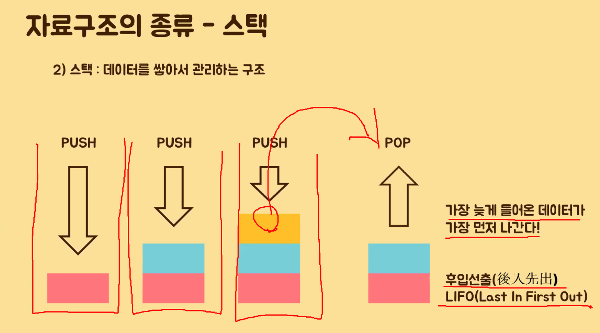
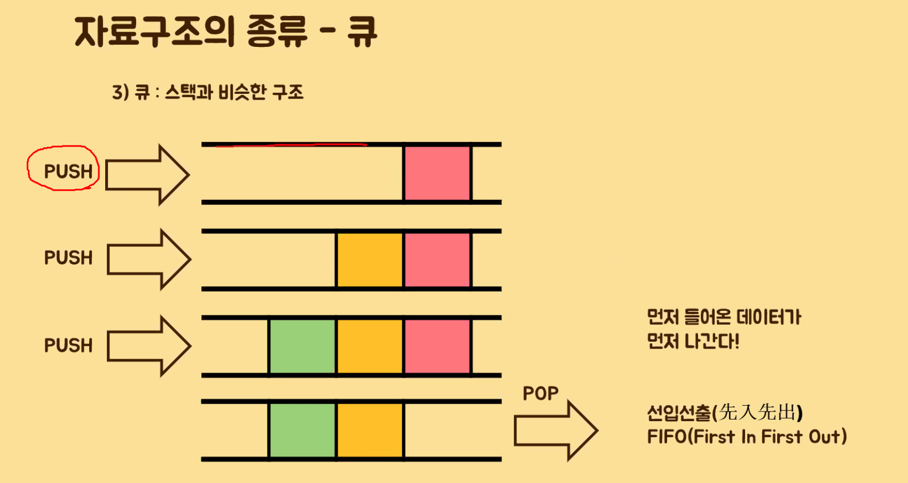

# 시간 복잡도
* 공간 복잡도: 변수가 적으면 적을수록
* 시간 복잡도: 얼마나 오랜 시간이 걸렸는가?
## 빅-오 표기법

* O(n): n의 값이 늘어나면 늘어날 수록 시간이 늘어난다
    - 1부터 100까지 for문 돌면서 더하기
* O(1)
    - 1부터 100까지 더할 때, n(n + 1) / 2 공식 이용하기
    - 1부터 100까지 짝수만 더하는 경우, n(n + 1) / 4 공식 이용하기
* O(n * 2)
    - for문이 두 번 반복될 때
    - ex. 구구단
# 자료구조가 필요한 이유
* 새로운 자료형 개발
* 기존의 자료형의 효율적 사용
* 대용량 자료형의 효율적 관리
# 워밍업 문제
## 1. 워밍업 문제(google)
1부터 10,000까지 8이라는 숫자가 총 몇번 나오는가?

8이 포함되어 있는 숫자의 갯수를 카운팅 하는 것이 아니라 8이라는 숫자를 모두 카운팅 해야 한다.
(※ 예를들어 8808은 3, 8888은 4로 카운팅 해야 함)

문제 링크 : https://codingdojang.com/scode/393
### 내 풀이
```js
// 정규 표현식을 사용하면 더 좋았을듯!
let str = '';
for (let i = 1; i <= 10000; i++){
    str += i;
}

let count = 0;
for (let i = 0; i < str.length; i++){
    if (str[i] == 8){
            count++;
    }
}
console.log(count);
```
```js
// https://deeplify.dev/front-end/js/count-characters-in-string
let count = 0;
for (let i = 1; i <= 10000; i++){
    let pos = i.toString().indexOf('8');
    while (pos !== -1){
        count++;
        pos = i.toString().indexOf('8', pos + 1);
    }
}
console.log(count);
```
### 다른 사람 풀이
```js
// 수민님 풀이
let str = '';

for (let i=1;i<=10000;i++) {
  str += i;
}

console.log(str.match(/8/g).length); 
```
```js
let str = '';

for (let i=1;i<=10000;i++) {
  str += i;
}

console.log(str.split("").filter((item) => item === '8').length);
```
```js
// 유린님 풀이
const arr = new Array(10000).fill(1).map((_, i) => i + 1).join('').match(/8/g).length;
```
```js
// 호준님 풀이
const arr = [...Array(10000)].map((_, i) => i + 1).toString().match(/8/g).length;
```
## 2. 워밍업 문제(daum)
1차원의 점들이 주어졌을 때, 그 중 가장 거리가 짧은 것의 쌍을 출력하는 함수를 작성하시오. (단 점들의 배열은 모두 정렬되어있다고 가정한다.)

예를들어 S={1, 3, 4, 8, 13, 17, 20} 이 주어졌다면, 결과값은 (3, 4)가 될 것이다.
### 내 풀이
```js
const arr = [1, 3, 4, 8, 13, 17, 20];
const res = [];
arr.reduce((acc, cur, i) => {
    if (i === 0){
        return acc + Infinity;
    } else {
        const diff = Math.abs(cur - arr[i - 1]);
        if (diff < acc){
            res[0] = arr[i - 1];
            res[1] = arr[i];
            return acc = 0 + diff;
        } else {
            return acc + 0;
        }
    }
}, 0);
console.log(res);
```
### 다른 사람 코드
앞 요소나 뒤 요소를 알아야 하기 때문에 for of문은 적절하지 않다.
```js
const dots = [1, 3, 4, 8, 13, 17, 20];
let 최솟값 = Infinity;
let 최솟값인덱스 = 0;
for (let i = 1; i < dots.length; i++){
    if (Math.abs(dots[i] - dots[i - 1]) < 최솟값){
        최솟값 = Math.abs(dots[i] - dots[i - 1]);
        최솟값인덱스 = i;
    }
}
console.log(dots[최솟값인덱스], dots[최솟값인덱스 - 1])
```
```js
const zip = (a, b) => a.map((v, i) => [v, b[i]]);
let s = [1, 3, 4, 8, 13, 17, 20];
let pairs = zip(s.slice(0, s.length - 1), s.slice(1));
let 최솟값 = Infinity;
let 최솟값쌍 = [];
for ([i, j] of pairs){
    if (j - i < 최솟값){
        최솟값 = j - i;
        최솟값쌍 = [i, j];
    }
}
```
### 짝 지어주는 메서드(파이썬의 zip)
```js
const zip = (a, b) => a.map((v, i) => [v, b[i]]);
zip([10, 20, 30], [1, 2, 3]);
```
# 자료구조 및 알고리즘
[시각화 자료](https://visualgo.net/en)
## 1. 스택과 큐
### 1.1. 스택

* pop(): 맨 뒤에 거 빼기
* push(): 맨 뒤에 추가
```js
// 새로운 자료형
// 스택 위키피디아 참고
class Stack {
    constructor(){
        this.arr = [];
        this.length = 0;
    }

    push(data){
        this.arr.push(data);
        this.length += 1;
    }

    pop(index){
        if (this.length === 0){
            return;
        } else if (index > this.arr.length - 1){
            this.length -= 1;
            return this.arr.pop();
        } else {
            let result = this.arr.splice(index, 1);
            this.length -= 1;
            return result;
        }
    }

    empty(){
        if (this.length === 0){
            return 1;
        } else {
            return 0;
        }
    }

    top(){
        return this.arr[this.arr.length - 1];
    }

    bottom(){
        return this.arr[0];
    }

    display(){
        return this.arr;
    }
}
```
### 1.2. 큐

* shift(): 맨 앞에 거 빼기
* push(): 맨 뒤에 추가
## 2. [연결리스트](https://en.wikipedia.org/wiki/Linked_list)(중요)
* 메모리 효율을 위해 사용되는 경우가 많음
* js에서는 그다지 메모리 효율이 좋지 못함
* Singly linked list
* Doubly linked list
* Circular linked list
    - 회전 초밥
```js
const list = {
    head: {
        value: 46
        next: {
            value: 49,
            next: {
                value: 97,
                next: {
                    value: 12,
                    next: null
                }
            }
        }
    }
};

// list.head.next.next.value; // 97
// list.head.next.next.next.value; // 12
```
```js
let list = {
    head: null
}

let node1 = {value: 46, next: null};
let node2 = {value: 49, next: null};
let node3 = {value: 97, next: null};
let node4 = {value: 12, next: null};

node1.next = node2;
node2.next = node3;
node3.next = node4;

list.head = node1;

node1.value; // 46
node1.next.value; // 49
node1.next.next.value; // 97
```
### 문제
내 코드
```js
// head -> [90, next] -> [2, next] -> [77, next] -> [35, next] -> [21, next] -> null
// 35를 출력해주세요.

let list = {
    head: null
};

let node1 = {value: 90, next: null};
let node2 = {value: 2, next: null};
let node3 = {value: 77, next: null};
let node4 = {value: 35, next: null};
let node5 = {value: 21, next: null};

list.head = node1;
node1.next = node2;
node2.next = node3;
node3.next = node4;
node4.next = node5;

console.log(list.head.value);
console.log(list.head.next.next.next.value);
```
강사님 코드(이게 더 가독성이 좋음)
1. object로 구현
```js
const list = {
    head:{
        value:90,
        next:{
            value:2,
            next:{
                value:77,
                next:{
                    value:35,
                    next:{
                        value:21,
                        next:null
                    }
                }
            }
        }
    }
}

list.head.next.next.next.value;
```
2. class로 node 구현
```js
class Node {
    constructor(data){
        this.data = data;
        this.next = null;
    }
}

const node1 = new Node(90);
const node2 = new Node(2);
const node3 = new Node(77);
const node4 = new Node(35);
const node5 = new Node(21);

node1.next = node2;
node2.next = node3;
node3.next = node4;
node4.next = node5;
```
3. class로 linkedList 구현
```js
// head -> ['init', next]
// head -> ['init', next] -> [90, next]
class Node {
    constructor(data){
        this.data = data;
        this.next = null;
    }
}

class LinkedList {
    constructor(){
        let init = new Node('init')
        this.head = init;
        this.tail = init;
    }

    append(data){
        let 새로운노드 = new Node(data);
        this.tail.next = 새로운노드;
        this.tail = 새로운노드;
    }
}

let l = new LinkedList();
l.append(1);
l.append(2);
l.append(3);
l.append(10);
l.append(20);
l.append(30);

console.log(l.head.data); // init
console.log(l.head.next.data); // 1
console.log(l.head.next.next.data); // 2
```
4. class로 linkedList에서 length 구현
```js
class Node {
    constructor(data){
        this.data = data;
        this.next = null;

        // this.length = 0;
        // 여기서 데이터를 추가하면 생성되는 노드마다 데이터 공간이 할당되는 것이라 메모리가 크게 필요함
    }
}

class LinkedList {
    constructor(){
        let init = new Node('init')
        this.head = init;
        this.tail = init;
        this.length = 0;
    }

    length(){
        return this.length;
    }

    append(data){
        let 새로운노드 = new Node(data);
        this.tail.next = 새로운노드;
        this.tail = 새로운노드;
        this.length += 1;
    }
}

let l = new LinkedList();
l.append(1);
l.append(2);
l.append(3);
l.append(10);
l.append(20);
l.append(30);
l.length; // 6
```
5. class로 linkedList에서 toString 구현
```js
class Node {
    constructor(data){
        this.data = data;
        this.next = null;

        // this.length = 0;
        // 여기서 데이터를 추가하면 생성되는 노드마다 데이터 공간이 할당되는 것이라 메모리가 크게 필요함
    }
}

class LinkedList {
    constructor(){
        let init = new Node('init')
        this.head = init;
        this.tail = init;
        this.length = 0;
        this.displayData = '';
    }

    length(){
        return this.length;
    }

    toString(){
        return '[' + this.displayData.slice(0, -2) + ']';
    }

    append(data){
        let 새로운노드 = new Node(data);
        this.tail.next = 새로운노드;
        this.tail = 새로운노드;
        this.length += 1;
        this.displayData += `${data}, `;
    }
}

let l = new LinkedList();
l.append(1);
l.append(2);
l.append(3);
l.append(10);
l.append(20);
l.append(30);
l.length;
l.toString(); // '[1, 2, 3, 10, 20, 30]'
```
6. step 6 - class로 linkedList에서 toArray 구현
```js
class Node {
    constructor(data){
        this.data = data
        this.next = null
    }
}

class LinkedList {
    constructor(){
        let init = new Node('init')
        this.head = init
        this.tail = init
        this.length = 0
        this.displayData = ''
        this.displayDataArr = []
    }

    length(){
        return this.length
    }

    toString(){
        return '<' + this.displayData.slice(0, -2) + '>'
    }

    toArray(){
        return this.displayDataArr
    }
    
    append(data){
        let 새로운노드 = new Node(data)
        // 마지막 값(null)은 새로운 노드가 됨
        this.tail.next = 새로운노드
        // 마지막 노드는 새로운 노드가 됨
        this.tail = 새로운노드
        this.length += 1
        this.displayData += `${data}, `
        this.displayDataArr.push(data)
    }
}

l = new LinkedList()
l.append(1)
l.append(2)
l.append(3)
l.append(10)
l.append(20)
l.append(30)
```
7. step 7 - (중요) toString을 순회로 구현
```js
class Node {
    constructor(data){
        this.data = data
        this.next = null
    }
}

class LinkedList {
    constructor(){
        let init = new Node('init')
        this.head = init
        this.tail = init
        this.length = 0
    }

    length(){
        return this.length
    }

    toString(){
        let 순회용현재노드 = this.head;

        // 처음 순회용 현재 노드가 init이기 때문에
        순회용현재노드 = 순회용현재노드.next;

        let 출력데이터 = '';
        for (let i = 0; i < this.length; i++){
            출력데이터 +=`${순회용현재노드.data}, `;
            순회용현재노드 = 순회용현재노드.next;
        }

        return 출력데이터;
    }
    
    append(data){
        let 새로운노드 = new Node(data)
        // 마지막 값(null)은 새로운 노드가 됨
        this.tail.next = 새로운노드
        // 마지막 노드는 새로운 노드가 됨
        this.tail = 새로운노드
        this.length += 1
    }
}

l = new LinkedList()
l.append(1)
l.append(2)
l.append(3)
l.append(10)
l.append(20)
l.append(30)
l.toString();
```